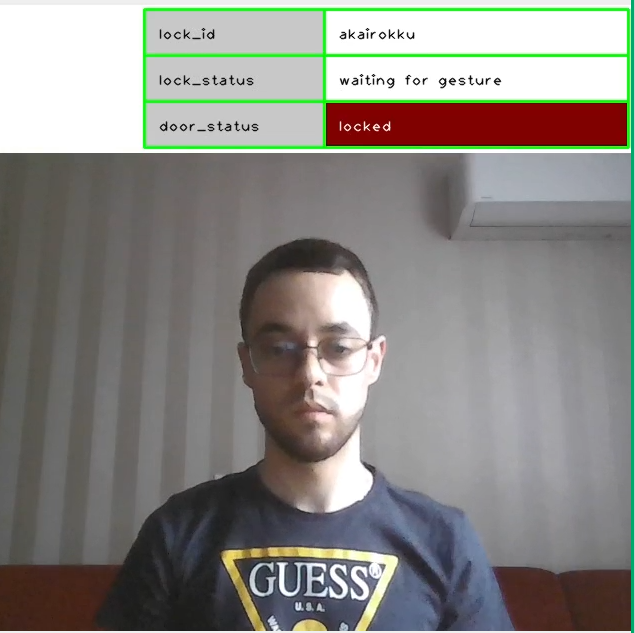
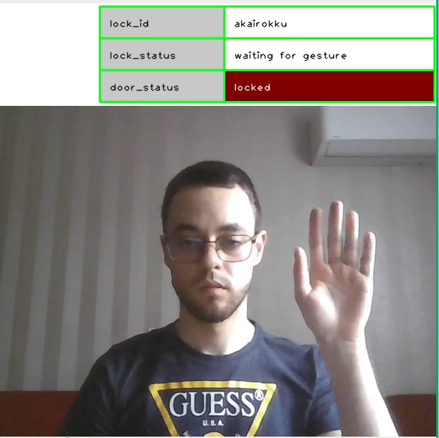
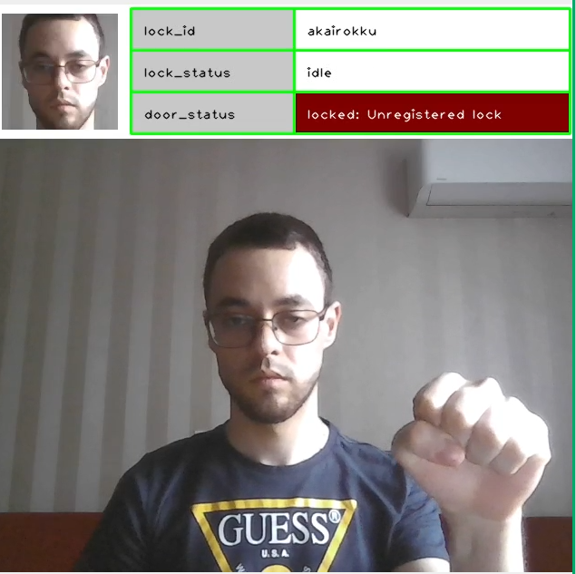
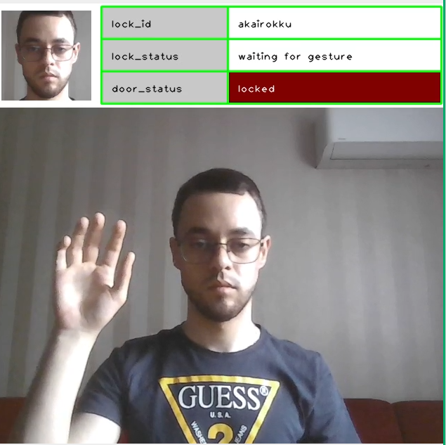
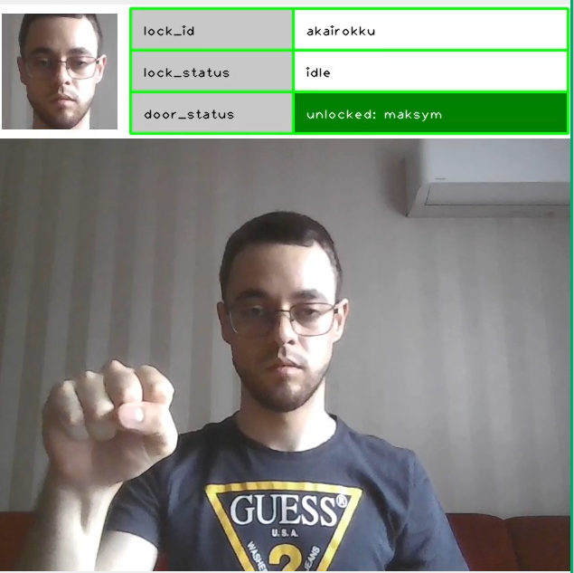
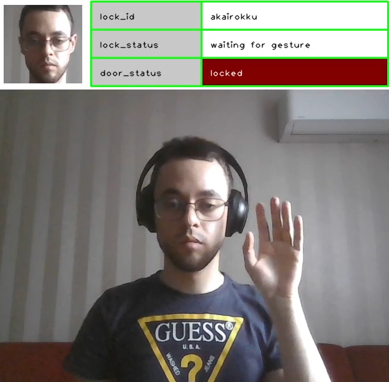
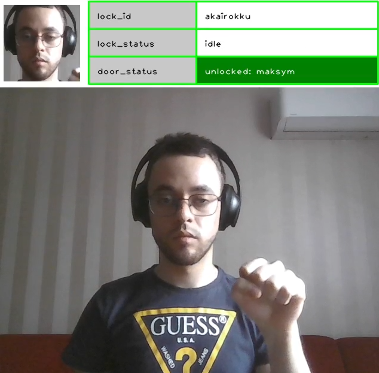
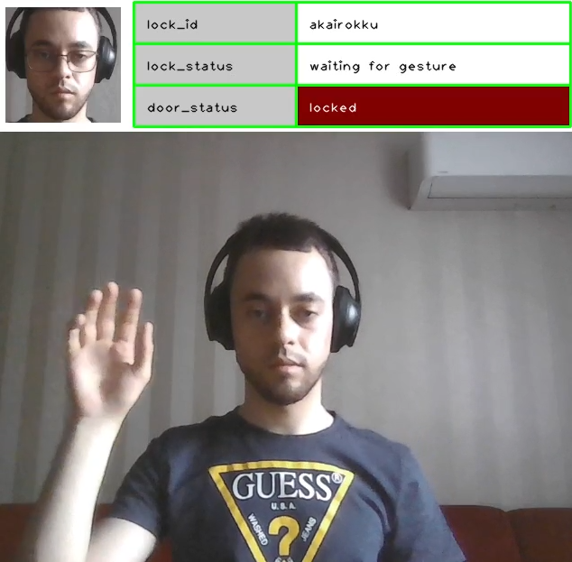
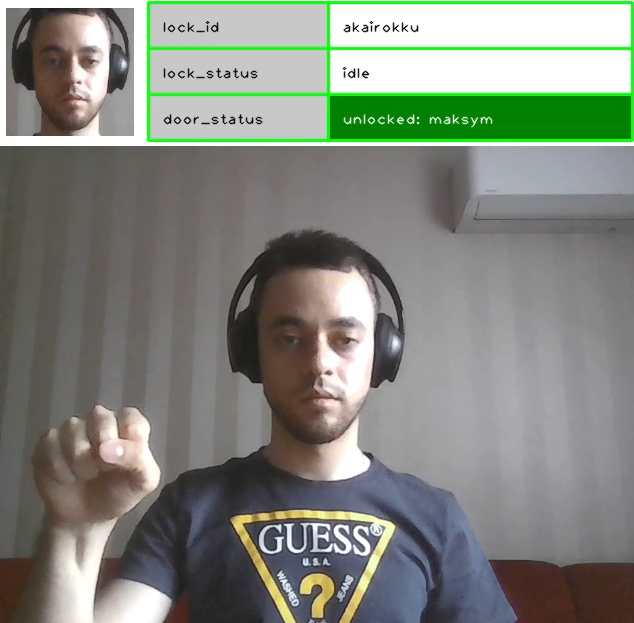

# lokilock
### Dataset example
```bash
tree /path/to/dataset
```
```
/path/to/dataset
├── andriy
│   ├── 1680880160.11034.jpg
│   └── ...
├── artem
│   ├── 1680869542.5649412.jpg
│   └── ...
├── lyda
│   ├── 1680897386.7001247.jpg
│   └── ...
├── maksym
│   ├── 1680869428.4691794.jpg
│   └── ...
├── oleksandr
│   ├── 1681236533.0020647.jpg
│   └── ...
├── pasha
│   ├── 1684076656.3398108.jpg
│   └── ...
├── roma
│   ├── 1680873282.217686.jpg
│   └── ...
├── sasha
│   ├── 1681114557.9838002.jpg
│   └── ...
├── taras
│   ├── 1680897641.4616404.jpg
│   └── ...
├── volodja
│   ├── 1681217745.35845.jpg
│   └── ...
└── yurii
    ├── 1680897137.382897.jpg
    └── ...
```

### Test locally
```bash
python -m venv .venv #python3.10+
chmod +x ./build.sh
```
```bash
./.venv/bin/activate
pip install -r requirements.txt
./build.sh
```
- Split terminal & run
    - T#1
    ```bash
    ./.venv/bin/activate
    bash lock.laptop.sh akairokku
    ```
    - T#2
    ```bash
    ./.venv/bin/activate
    docker compose -f docker-compose.server.cpu.yaml up --build
    # wait untill all services initialzed
    ```
    |Idle|Activation Gesture Begin|Activation Gesture End|
    |:---:|:---:|:---:|
    |||
    - T#3
    ```
    ./.venv/bin/activate
    python -m enroll http://localhost:5001 akairokku --enroll path/to/dataset
    ```
   
|Activation Gesture Begin|Activation Gesture End|
|:---:|:---:|
|||
|||
|||
